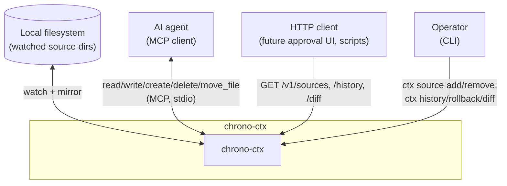
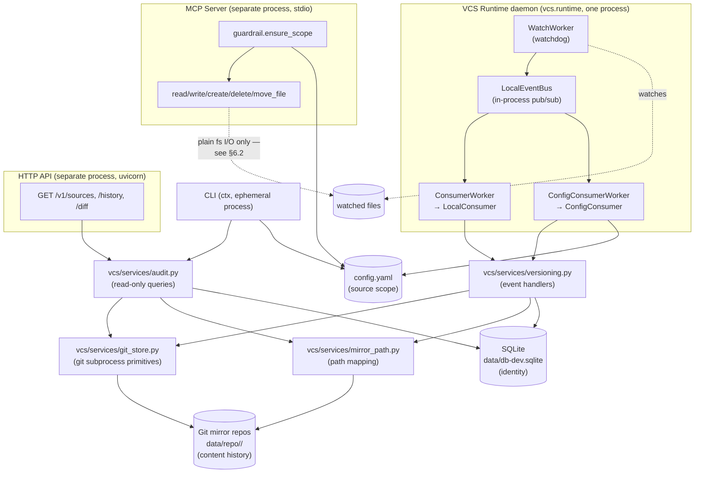
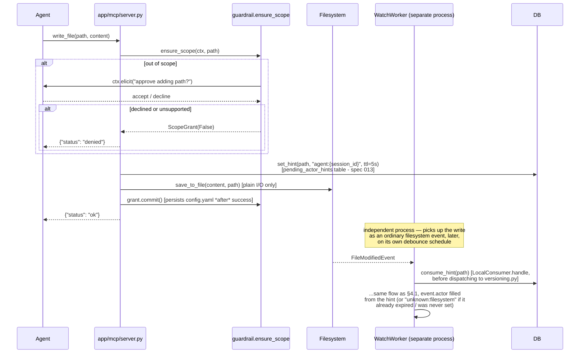
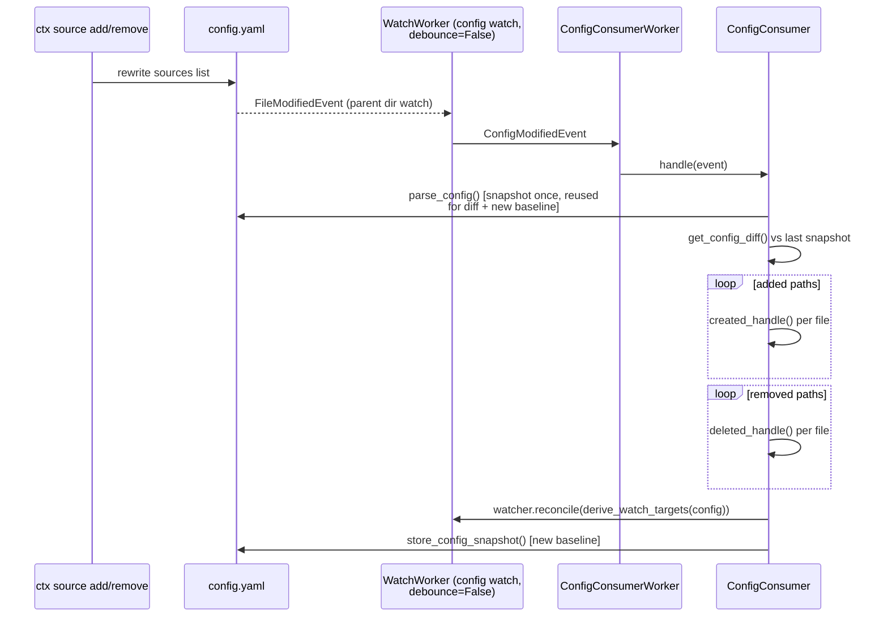

# Architecture

Detailed reference for how chrono-ctx is put together. For the short version —
what it is, current status, how to run it — see [README.md](README.md).

This doc follows a light [arc42](https://arc42.org)/[C4](https://c4model.com)
shape, scaled to this project's actual size: context and container views,
the runtime flows that matter, the data model, and the cross-cutting
decisions that aren't obvious from reading one file in isolation.

## 1. Goals and constraints

chrono-ctx versions the *context sources* an AI agent reads from (docs,
prompts, workflows) — not by making the source directory itself a git repo,
but by mirroring watched content into a separate git repository per watch
target and committing on every observed change. Three surfaces read/write
that state: a filesystem watcher daemon (always-on), an MCP tool server (for
an agent), and a read-only HTTP API (for anything else, e.g. a future
approval UI).

Constraints that shape the design below:

- **`git` binary required at runtime** — storage shells out to it via
  `subprocess` rather than a pure-Python git implementation (`dulwich`).
  Chosen for well-tested rename/tree/diff semantics over reimplementing them;
  revisit only if chrono-ctx ever needs to ship without an external binary
  assumption.
- **Windows is a first-class dev target** — path separators, drive letters
  (`C:\...`), and `st_ino`/`st_dev` identity semantics all needed explicit
  handling (see [§5](#5-data-model) and [§7](#7-cross-cutting-concerns)).
- **Single trusted caller, today** — the HTTP API and the MCP guardrail both
  assume one operator/host, not multi-tenant auth. Documented as a real gap,
  not silently assumed away — see [§8](#8-known-gaps).

## 2. Context view



## 3. Container view



Today these are **three independently-started processes** with no shared
supervisor — `Dockerfile` only wraps `vcs.runtime`; the MCP server runs via
`fastmcp.json` (stdio) or `uv run python -m app.mcp.server`; the HTTP API
runs via `uv run python -m app.api.server`. Nothing currently keeps them in
sync beyond all three reading the same `config.yaml`/DB/git mirrors on disk.

## 4. Runtime flows

### 4.1 Filesystem edit → git commit (the core loop)

```mermaid
sequenceDiagram
    participant FS as Filesystem
    participant WW as WatchWorker
    participant Bus as LocalEventBus
    participant CW as ConsumerWorker
    participant LC as LocalConsumer
    participant V as versioning.py
    participant GS as git_store.py

    FS->>WW: watchdog FileModifiedEvent
    WW->>WW: normalize_event() → ModifiedEvent
    WW->>WW: debounce (0.5s default)
    WW->>Bus: publish(event)
    Bus->>Bus: fan out to subscriptions<br/>matching topic + where predicate
    Bus->>CW: queue.put(event)
    CW->>LC: consumer.handle(event)
    LC->>V: modified_handle(db, event, tmp_file)
    V->>V: _should_commit()? (text_similarity vs<br/>NEW_VERSION_THRESHOLD=0.9)
    alt similar enough to skip
        V-->>LC: no commit
    else content changed enough
        V->>V: resolve_mirror_location(event.src)
        V->>GS: write(repo, relpath, content,<br/>message, author) [under per-repo lock]
        GS->>GS: git add; diff --cached --quiet (no-op check);<br/>git commit --author=...
        GS-->>V: new rev
    end
```

`created_handle`/`deleted_handle` skip the similarity gate — every create
and every delete always commits. Only `modified_handle` gates on
`_should_commit`.

### 4.2 MCP-triggered edit



The MCP write tools deliberately do **plain filesystem I/O only** — no
direct call into `versioning.py`. The watcher already tracks every
filesystem change independently of who made it; calling both would
double-commit the same edit. That decoupling used to cost actor
attribution entirely; a pending-hint handoff through a shared SQLite table
(§6.2, spec 013) closes that gap without coupling the two processes
directly.

### 4.3 Config hot-reload



`ConfigDeletedEvent`/`ConfigMovedEvent` (the config file itself vanishing or
being renamed) instead call `recover_config()`, restoring it from the last
good snapshot — config.yaml is load-bearing for scope enforcement, so losing
it must not silently disable the guardrail.

## 5. Data model

Two independent stores, deliberately not merged:

**SQLite** (`data/schema.sql`) — *identity and scope*, not content:

```sql
contexts (context_id PK)
locations (st_ino, st_dev PK, context_id, location, provider, status)
versions   -- dead: pre-git-backend blob versioning; kept, unused, unpopulated
```

Files are identified by `(st_ino, st_dev)` — filesystem inode, not path — so
a rename/move doesn't look like a delete-then-create. `status` marks whether
a location is currently in scope (`1`) or has moved/been deleted out from
under tracking (`0`). Windows inode semantics differ from POSIX but are
stable enough for this purpose; `get_path_stats()` abstracts the platform
difference.

**Git mirrors** (`data/repo/<target>/`) — *content and history*. One repo per
`derive_watch_targets()` boundary (not one global repo — a deliberate
least-privilege choice: scope stays as narrow as the directories actually
granted, matching the MCP guardrail's file-granular philosophy). Path
mapping is pure and deterministic:

```python
resolve_mirror_location(source_path, watch_targets) -> (repo_path, relpath)
```

`repo_dir_name` strips a Windows drive colon (`C:/src` → `C/src`) since
`path_normalize()` already yields posix separators. `data/repo/` is
`.gitignore`d from the outer chrono-ctx repo — nesting a git repo there
unignored would register as a `160000` gitlink entry (a bare commit-SHA
pointer, no content), and a later `checkout`/`reset` on the outer repo could
silently wipe the entire mirror tree.

`git log` **is** the version table for a mirrored file; nothing duplicates
commit metadata into SQLite.

## 6. Cross-cutting concerns

### 6.1 Concurrency

One cross-process file lock (`filelock.FileLock`, a `.chrono-ctx.lock` file
inside each mirror repo) per resolved repo path (module-level dict, guarded
by its own `threading.Lock` against two threads racing to create the first
lock object for a given path) serializes every git-mutating call
(`add`/`rm`/`mv`/`commit`) against that repo — required because
`.git/index.lock` doesn't arbitrate concurrent writers the way SQLite's WAL
mode does. Different repos never block each other. A real OS-level file
lock, not a `threading.Lock` (spec 012): the CLI and HTTP API run as
separate processes from the daemon, and a `threading.Lock` can't see across
a process boundary — two processes racing real `git` subprocess calls
against the same mirror repo could otherwise interleave and corrupt it.
`filelock.FileLock` is documented thread-safe when the same instance is
reused, so the daemon's own two worker threads (source-event and
config-event consumers) still serialize through one shared instance exactly
as before.

**"Conflict" is reframed as lost-update, not merge-conflict.** Because of
the single-writer lock plus linear per-repo history, this system can
structurally never produce a real git merge conflict — only a stale-read
overwrite. `write_with_check(expected_rev=...)` is an optimistic
compare-and-swap: if the mirror's current head has moved past
`expected_rev`, it raises `ConcurrentEditError` with the current rev/author/
timestamp instead of committing. `rollback_source` (spec 012) is its one
real caller today — a rollback racing a concurrent newer commit raises
`ConcurrentEditError` instead of clobbering it.

### 6.2 Actor attribution

`SourceEvent.actor: str | None`. `_resolve_actor()` turns it into a
`(label, git-author-string)` pair, e.g. `"agent:sess-9f3a"` →
`"agent:sess-9f3a <agent@chrono-ctx.local>"`, defaulting to
`"unknown:filesystem"` when unset. Two capture paths are wired: the startup
directory scan (`local_adapter.py`, labeled `"startup:scan"`), and
MCP-triggered edits via a **pending actor hint** (spec 013,
[issues.md #23](docs/agents/issues.md), fixed) — `vcs/services/actor_hints.py`'s
`set_hint`/`consume_hint` over a `pending_actor_hints` SQLite table, the same
cross-process-shared store used for identity. The MCP server and the daemon
are separate processes (an in-memory dict can't bridge them, same
constraint as the repo lock in §6.1), so an MCP write tool records
`"agent:{session_id}"` for the path just before its filesystem I/O, and
`LocalConsumer.handle` consumes it — reads then deletes — right before
dispatching to `versioning.py`, filling in `event.actor` if the event didn't
already carry one. A 5s TTL bounds how long a hint can outlive its write
(covers the watcher's 0.5s debounce plus dispatch latency); an unconsumed
or expired hint just falls back to `"unknown:filesystem"`, same as before
spec 013. A raw filesystem edit with no MCP call at all — the case
[competitive-landscape.md](docs/agents/competitive-landscape.md) flagged as
a strength to keep watching regardless — still has no identity to capture,
which is correct: there's nothing to attribute. CLI actor capture stays out
of scope: no CLI command currently writes content through the watcher path
(`ctx rollback` attributes its own commit directly via `git_store`, no
watcher round-trip involved).

### 6.3 Scope enforcement — two different fail-closed models

- **MCP guardrail** (`app/mcp/guardrail.py`): fail-closed *with* a recovery
  path — an out-of-scope call triggers an MCP elicitation asking the calling
  agent's user to approve widening scope. Approval is persisted to
  `config.yaml` only *after* the underlying operation succeeds, so a failed
  op never permanently widens scope.
- **Audit read API** (`vcs/services/audit.py`, both the CLI and the HTTP
  surface): fail-closed with **no** recovery path — `OutOfScopeError` simply
  rejects. A read-only surface has no legitimate reason to silently grant
  new access the way a live agent write does.

### 6.4 Pub/sub bus

`vcs/workers/bus.py`'s `LocalEventBus` is modeled after an AMQP topic
exchange on purpose (`Subscription` = queue + binding key, `topic_matches`
implements `#`/`*` wildcard matching) so that swapping in a real broker
(RabbitMQ — see [rabbitmq-migration.md](docs/agents/rabbitmq-migration.md))
later is a broker substitution, not a rewrite. Delivery is asynchronous by
design: `publish()` only enqueues, because running handlers inline on
watchdog's dispatcher thread — which holds `BaseObserver._lock` — would
deadlock against `ConfigConsumer`'s `watcher.reconcile()`, which needs that
same lock.

## 7. Module map

```
src/
├── app/
│   ├── cli/app.py            # typer CLI (ctx ...)
│   ├── mcp/
│   │   ├── server.py         # FastMCP stdio server, 5 tools
│   │   └── guardrail.py      # ensure_scope / ScopeGrant
│   └── api/
│       ├── server.py         # FastAPI app, CORS, uvicorn entrypoint
│       ├── deps.py           # get_db_handler (request-scoped DBHandler)
│       └── router/v1/vcs.py  # GET /sources, /history, /diff
├── vcs/
│   ├── runtime.py            # VCSRuntime: Initializer + LocalRuntime
│   ├── initialize.py         # schema + config bootstrap, initial source scan
│   ├── adapters/local_adapter.py   # startup directory scan → _append_context
│   ├── db/sqlite.py          # DBHandler: thin sqlite3 wrapper
│   ├── shared/
│   │   ├── types.py          # SourceEvent hierarchy, event (de)serialization
│   │   ├── config.py         # path config: GIT_REPO_DIR, BLOB_DIR (dead), ...
│   │   └── temp_file.py      # staging file for modified_handle's diff read
│   ├── services/
│   │   ├── configure.py      # config.yaml: scope, watch-target derivation
│   │   ├── versioning.py     # event handlers: created/modified/deleted/moved
│   │   ├── git_store.py      # git subprocess primitives, per-repo lock
│   │   ├── mirror_path.py    # source path → (repo_path, relpath)
│   │   ├── audit.py          # queries + rollback_source over the git backend
│   │   ├── actor_hints.py    # cross-process pending-actor handoff (spec 013)
│   │   └── db.py             # schema init
│   └── workers/
│       ├── bus.py            # LocalEventBus (AMQP-shaped pub/sub)
│       ├── consumer_worker.py    # generic queue-drain thread
│       ├── interfaces/           # Consumer, EventBroker ABCs
│       └── local/
│           ├── local_watcher.py  # watchdog wrapper, debounce, reconcile
│           ├── local_queue.py    # Queue-backed EventBroker
│           ├── local_consumer.py # SourceEvent → versioning.*_handle
│           └── local_runtime.py  # wires watcher + bus + both consumers
└── utils/                    # helper.py, formatter.py, logger.py
```

## 8. Known gaps

Full issue log: [docs/agents/issues.md](docs/agents/issues.md) — every
logged issue is closed as of specs 014-017 (Tier 3: wheel packaging,
`TempFile.TMP_DIR` anchoring, SQLite WAL/timeout, SIGTERM handling). #21/#22
turned out already fixed by the git-backend migration (`dec14a3`, spec 006)
but were never marked as such until the 2026-09-09 re-audit; #17/#18 were
moot — they described the pre-migration blob/content-hash storage model,
which that same migration replaced outright.

Gaps not yet logged there:

- **No process supervision** across the three entrypoints (§3) — running the
  full system today means starting the daemon, the MCP server, and the HTTP
  API by hand.
- **No auth model** on the HTTP API or a per-caller scope — both assume a
  single trusted, same-host caller.
- **No HTTP write endpoint for rollback.** `ctx rollback` (CLI-only, spec
  012) covers the interactive case; a remote/HTTP rollback trigger is still
  out of scope, same reasoning as
  [010-audit-http-api.md](docs/specs/010-audit-http-api.md)'s read-only
  scoping.

Resolved since first written (kept here for the trail): the CLI used to be
wired but not usable end-to-end (didn't print output, `ctx diff` still took
`int` version numbers), and `rollback_source` was a stub — both closed by
specs [011](docs/specs/011-cli-output-wiring.md) and
[012](docs/specs/012-rollback-source.md). §6.1's per-repo lock is now a
cross-process file lock (`filelock`), not `threading.Lock`. MCP-triggered
edits used to always attribute to `unknown:filesystem` — closed by spec
[013](docs/specs/013-actor-hints.md) (§6.2).

## 9. Testing

```
tests/
├── unit/          # fast: in-memory SQLite, tmp_path git repos, mocked watcher
└── integration/   # real subprocess git (test_git_store.py),
                    # real thread shutdown (test_local_runtime_shutdown.py)
```

Fixtures in `tests/fixtures/` (`db_handler`, `config_path`, `repo_path`/
`initialized_repo`, `seeder`) are registered globally via `pytest_plugins` in
`tests/conftest.py`. CI (`.github/workflows/ci.yaml`) runs `ruff check .` +
`pytest --cov=src` on Python 3.10 through 3.14 on `ubuntu-latest`.

